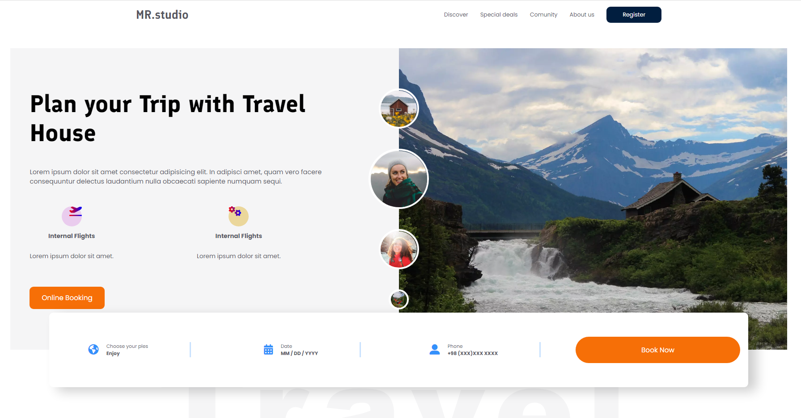

<!-- PROJECT LOGO -->
 

    

  <h3 align="center">.: Travel Agency :.</h3>

  

    MR.Studio- Tour & Travel Agency Template suitable for travel agencies, adventure parks, tourism and tour companies. It is 100% responsive and looks stunning on all types of screens and devices.
      
    <a href="https://vida-heidari.github.io/Travel-Agency-Landing-page/" target="_blank"><strong>View Live</strong></a>
        
        
    ·
    <a href="https://github.com/Vida-Heidari/Travel-Agency-Landing-page/issues">Report Bug</a>
    ·
    <a href="https://github.com/Vida-Heidari/Travel-Agency-Landing-page/issues">Request Feature</a>
  

<!-- ABOUT THE PROJECT -->

## About The Project

  <h5 align="center">Travel Agency</h5>

This is the HTML Template, only provide front-end HTML interface NO back-end.

### Built With

- [HTML5](https://html.spec.whatwg.org/multipage/)
- [CSS3](https://www.w3.org/Style/CSS/Overview.en.html)
- [JavaScript](https://www.javascript.com/)
- [Sass](https://sass-lang.com/)

  <!-- ROADMAP -->

## Roadmap

- [&#xD7;] Implement Landing page
- [&#xD7;] Add features list
- [ ] Implement About page
- [ ] Implement Comunity page

<!-- CONTRIBUTING -->

## Contributing

Contributions are what make the open source community such an amazing place to learn, inspire, and create. Any contributions you make are **greatly appreciated**.

If you have a suggestion that would make this better, please fork the repo and create a pull request. You can also simply open an issue with the tag "enhancement".
Don't forget to give the project a star! Thanks again!

1. Fork the Project
2. Create your Feature Branch (`git checkout -b feature/AmazingFeature`)
3. Commit your Changes (`git commit -m 'Add some AmazingFeature'`)
4. Push to the Branch (`git push origin feature/AmazingFeature`)
5. Open a Pull Request

<!-- CONTACT -->

## Contact

> If you have any questions, send an [email](mailto:vidaaheidari@gmail.com) to me.

<!-- MARKDOWN LINKS & IMAGES -->

[contributors-shield]: https://img.shields.io/github/contributors/othneildrew/Best-README-Template.svg?style=for-the-badge
[contributors-url]: https://github.com/othneildrew/Best-README-Template/graphs/contributors
[forks-shield]: https://img.shields.io/github/forks/othneildrew/Best-README-Template.svg?style=for-the-badge
[forks-url]: https://github.com/othneildrew/Best-README-Template/network/members
[stars-shield]: https://img.shields.io/github/stars/othneildrew/Best-README-Template.svg?style=for-the-badge
[stars-url]: https://github.com/othneildrew/Best-README-Template/stargazers
[issues-shield]: https://img.shields.io/github/issues/othneildrew/Best-README-Template.svg?style=for-the-badge
[issues-url]: https://github.com/othneildrew/Best-README-Template/issues
[license-shield]: https://img.shields.io/github/license/othneildrew/Best-README-Template.svg?style=for-the-badge
[license-url]: https://github.com/othneildrew/Best-README-Template/blob/master/LICENSE.txt
[linkedin-shield]: https://img.shields.io/badge/-LinkedIn-black.svg?style=for-the-badge&logo=linkedin&colorB=555
[linkedin-url]: https://linkedin.com/in/othneildrew
[product-screenshot]: https://i.ibb.co/VY7Qc9n/view.png
